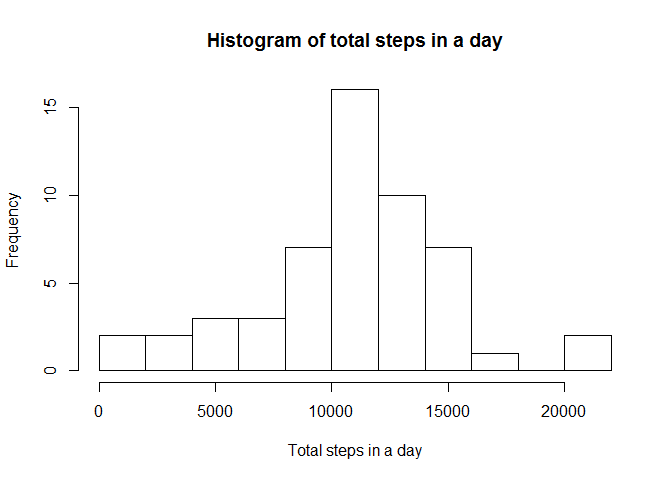
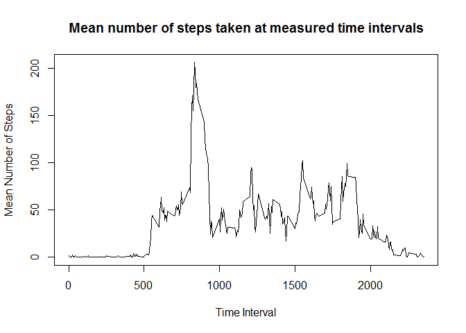
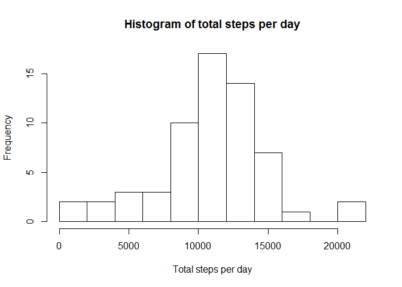
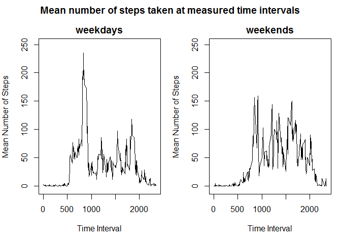

# Reproducible Research: Peer Assessment 1


## Loading and preprocessing the data

```r
library(dplyr)  
```

```
## 
## Attaching package: 'dplyr'
```

```
## The following objects are masked from 'package:stats':
## 
##     filter, lag
```

```
## The following objects are masked from 'package:base':
## 
##     intersect, setdiff, setequal, union
```

```r
data <- read.table(unz("./activity.zip", "activity.csv"), header=T, quote="\"", sep=",") 
old.par <- par(mar = c(0, 0, 0, 0))
```


## What is mean total number of steps taken per day?
First, Aggregate data by getting mean total number of steps in a day

```r
data.dateSum <- aggregate(x = data[c("steps")],  
                      FUN = sum,  
                      by = list(date = data$date))  
```

Create histogram of total steps 

```r
hist(data.dateSum$steps, 15, xlab = "Total steps in a day", main = "Histogram of total steps in a day")  
```

\

Get mean and median values of the total steps in a day 

```r
steps_mean <- mean(data.dateSum$steps, na.rm=TRUE)  
steps_median <- median(data.dateSum$steps, na.rm=TRUE) 

steps_mean
```

```
## [1] 10766.19
```

```r
steps_median
```

```
## [1] 10765
```


## What is the average daily activity pattern?
Aggregate data by getting mean number of steps per interval (most active interval on average)  

```r
data.timeMean <- aggregate(x = data[c("steps")],  
                          FUN = mean,  
                          na.rm = TRUE,  
                          by = list(interval = data$interval))  
```

Line plot to show mean number of steps at given time intervals

```r
plot(data.timeMean$interval, data.timeMean$steps, type = "l", xlab = "Time Interval", 
     ylab = "Mean Number of Steps", main = "Mean number of steps taken at measured time intervals")  
```

\

Get interval with maximum number of steps

```r
interval_stepsMax <- data.timeMean[data.timeMean$steps == max(data.timeMean$steps),]$interval
interval_stepsMax
```

```
## [1] 835
```


## Inputing missing values
Get count of NA values 

```r
n_NA <- sum(is.na(data$steps))  
n_NA
```

```
## [1] 2304
```

Strategy: separate data by day of the week and average the number of steps per given time interval.  Use these averaged time interval values by day to replace appropriate NA values.

Add day specification (Monday, Tuesday, Wednesday, etc...) to data points

```r
data$day <- weekdays(as.Date(data$date))
```

For non NA values, group data by day of the week and time interval, then find means of those groups

```r
data.dayInt <- data[complete.cases(data),] %>%
  group_by(day, interval) %>%
  summarize(meanSteps = mean(steps))
```

Make a copy of data and replace NA values with mean values grouped by day of week and time interval.
For some reason, this command needs to be run twice in order to update all of the NA values.
The last 288 don't get updated the first time, but do the second time.  Programming, am I right?

```r
data.replaceNa <- data
data.replaceNa$steps[is.na(data.replaceNa$steps)] <- data.dayInt$meanSteps[
                                                match(data.replaceNa$day, data.dayInt$day)
                                              & match(data.replaceNa$interval, data.dayInt$interval)
                                             ]
```

```
## Warning in data.replaceNa$steps[is.na(data.replaceNa$steps)] <- data.dayInt
## $meanSteps[match(data.replaceNa$day, : number of items to replace is not a
## multiple of replacement length
```

```r
data.replaceNa$steps[is.na(data.replaceNa$steps)] <- data.dayInt$meanSteps[
                                                match(data.replaceNa$day, data.dayInt$day)
                                              & match(data.replaceNa$interval, data.dayInt$interval)
                                             ]
```

```
## Warning in data.replaceNa$steps[is.na(data.replaceNa$steps)] <- data.dayInt
## $meanSteps[match(data.replaceNa$day, : number of items to replace is not a
## multiple of replacement length
```

Aggregate data by getting mean number of steps per interval

```r
data.dateSumReplaceNa <- aggregate(x = data.replaceNa[c("steps")],
                          FUN = sum, 
                          by = list(date = data.replaceNa$date))
```

Histogram of total steps

```r
hist(data.dateSumReplaceNa$steps, 15, xlab = "Total steps per day", main = "Histogram of total steps per day")
```

\

Get mean and median values of the total steps in a day

```r
stepsRepNa_mean <- mean(data.dateSumReplaceNa$steps, na.rm=TRUE)
stepsRepNa_median <- median(data.dateSumReplaceNa$steps, na.rm=TRUE)

stepsRepNa_mean
```

```
## [1] 10804.4
```

```r
stepsRepNa_median
```

```
## [1] 11015
```

Both mean and median values increased when replacing NA values with values averaged for 
intervals as a function of the day of the week.  By putting in this missing data, we are strengthing the impact of days which contained the most NA values.  Here's a table of the quantity of NA values per day of the week:

```r
table(data[is.na(data$steps),]$day)
```

```
## 
##    Friday    Monday  Saturday    Sunday  Thursday Wednesday 
##       576       576       288       288       288       288
```
This indicates that our missing data is representative of days with a higher than normal step average compared to the data as a whole.


## Are there differences in activity patterns between weekdays and weekends?

New variable that indicates if the day is a weekday or a weekend

```r
data.replaceNa$weekday <- ifelse(substr(weekdays(as.Date(data.replaceNa$date)), 0,1) != 'S', "weekday", "weekend")
```

Split data from weekdays and weekends

```r
data.weekdays <- data.replaceNa[data.replaceNa$weekday == "weekday",]
data.weekends <- data.replaceNa[data.replaceNa$weekday == "weekend",]

data.meanWeekdays <- aggregate(x = data.weekdays[c("steps")],
                           FUN = mean,
                           na.rm = TRUE,
                           by = list(interval = data.weekdays$interval))

data.meanWeekends <- aggregate(x = data.weekends[c("steps")],
                               FUN = mean,
                               na.rm = TRUE,
                               by = list(interval = data.weekends$interval))
```

Set Plot Attributes and plot

```r
main_text <- "Mean number of steps taken at measured time intervals"
xlab_text <- "Time Interval"
ylab_text <- "Mean Number of Steps"
y_lim <- c(-5, 250)

par(mfrow = c(1, 2), mar = c(5, 4, 2, 1), oma = c( 0, 0, 2, 0 )) 

plot(data.meanWeekdays$interval, data.meanWeekdays$steps, type = "l", xlab = xlab_text, 
     ylab = ylab_text, ylim = y_lim, main = "weekdays")

plot(data.meanWeekends$interval, data.meanWeekends$steps, type = "l", xlab = xlab_text, 
     ylab = ylab_text,ylim = y_lim, main = "weekends")

title( main_text, outer = TRUE )
```

\

```r
par(old.par)
```
